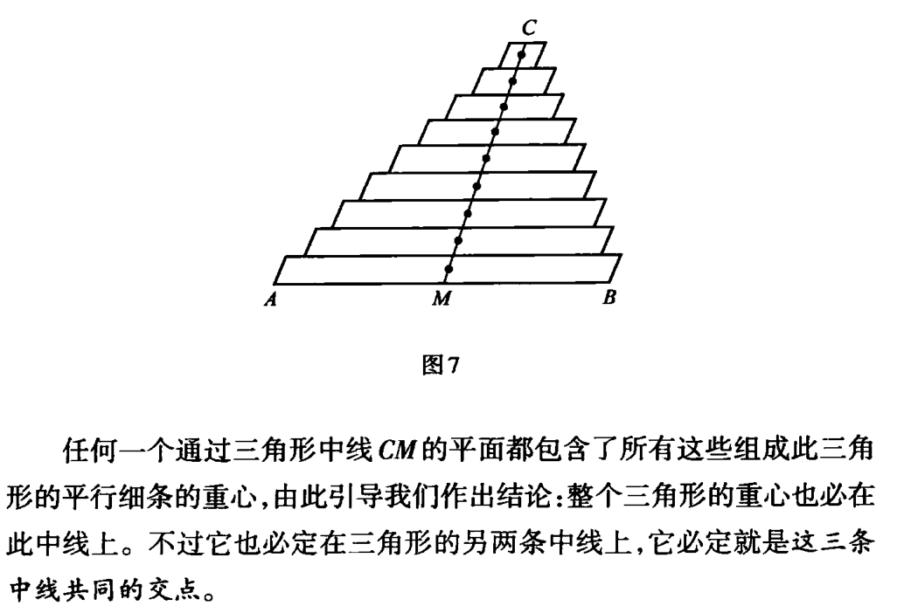
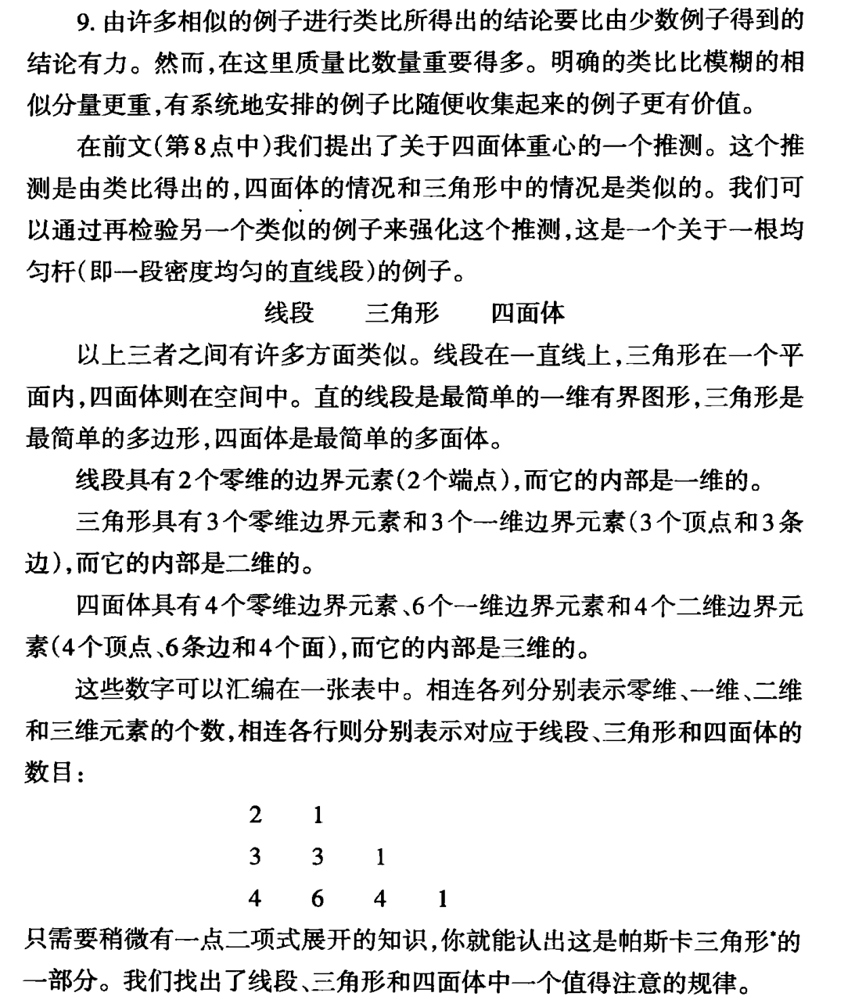
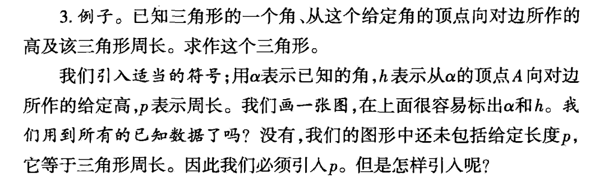
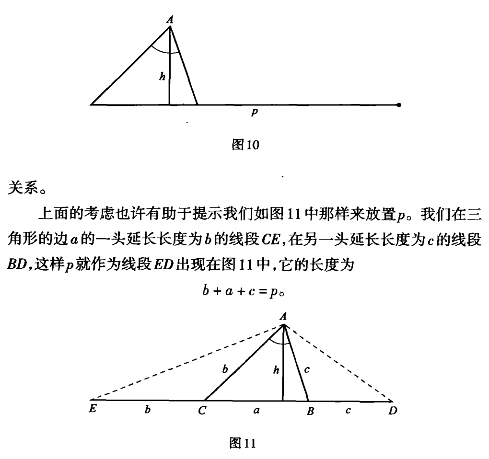
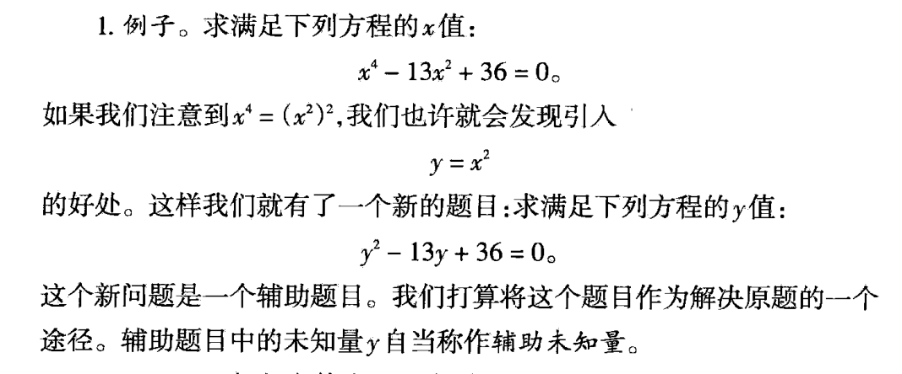

# Analogy

Find the center of gravity blow :
Point->Line->Triangle->Pyramid(Tetrahedron)->Square
**Use Analogy approach can progressive solve the main problem.**
**We call it 'inference by analogy'**
`Inference by analogy appears to be the **most common** kind of conclusion, and
it is possibly the most essential kind. It yields more or less plausible conjectures
which may or may not be confirmed by experience and stricter reasoning`

# Auxiliary elements (辅助元素)

# Auxiliary problem
